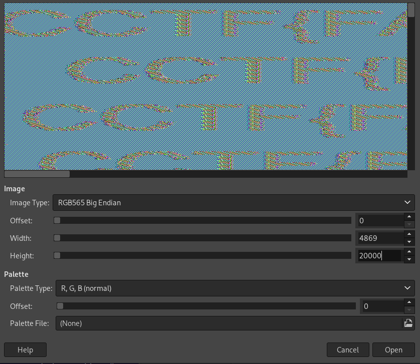
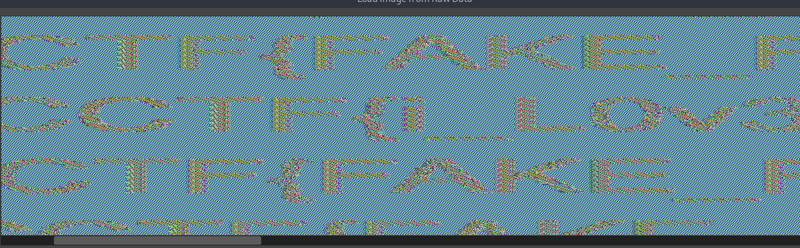

# Crypto CTF 2024
##  Beheaded | Easy | 131 pts

Task description:

```
The beheaded flags have had their headers removed, making them encrypted. Can a living entity truly survive without a head?
```

Attachments:

`behead_me.sh`

```bash
#!/bin/bash

source secrets.sh

FLAGS="all_flags.txt"
rm -f "all_flags.enc"

while read flag; do
	magick -background white -fill blue -pointsize 72 -size "$X"x"$Y" -gravity North caption:"$flag" flag.ppm
	tail -n +4 flag.ppm > tail
	openssl enc -aes-256-ecb -pbkdf2 -nosalt -pass pass:"$KEY" -in tail >> "all_flags.enc"
done < "$FLAGS"
```

[all_flags.enc](./all_flags.enc)

## Solution

This challenge creates several(yeah...) images in `ppm` format. And encrypts them. Using ECB. Well, you know that picture 


The thing is, we do not know the dimensions of the images. Height is ok, nothing urgent here. But witdh is the key value here. 


```python
!wc -c ./all_flags.enc
```

    100691360 ./all_flags.enc


```python
factor(100691360)
```


    2^5 * 5 * 7 * 11^2 * 743


Doesn't look like a ppm... I can't see 6. 

Then we think of a padding. Ok let's check that


```python
for i in range(1, 17):
    if (100691360 - i) % 6 == 0:
        print(factor(100691360 - i))
```

    2 * 3 * 61 * 103 * 2671
    2^3 * 3^2 * 67 * 20873
    2 * 3 * 7 * 79 * 30347


That's more familiar. However it didn't help. So let's find the width manually. Using gimp.

First you should rename your file and give it extra `.data` extension. Otherwise gimp will not recognize it and won't open it.


After pushing the up arrow for a <b>while<b> I got the following width:




```python
for i in range(1, 17):
    print((100691360 - i) % 4869)
```

    439
    438
    437
    436
    435
    434
    433
    432
    431
    430
    429
    428
    427
    426
    425
    424


I have no clue what happend, whatever.

After scrolling for a while you will notice a flag **among** the fake ones



`CCTF{i_LOv3_7He_3C8_cRypTo__PnNgu1n!!}`
